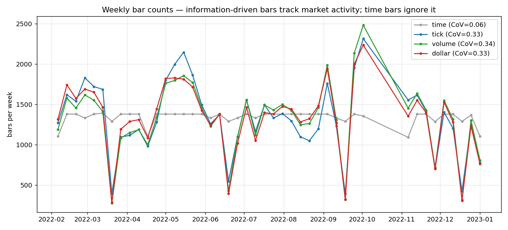
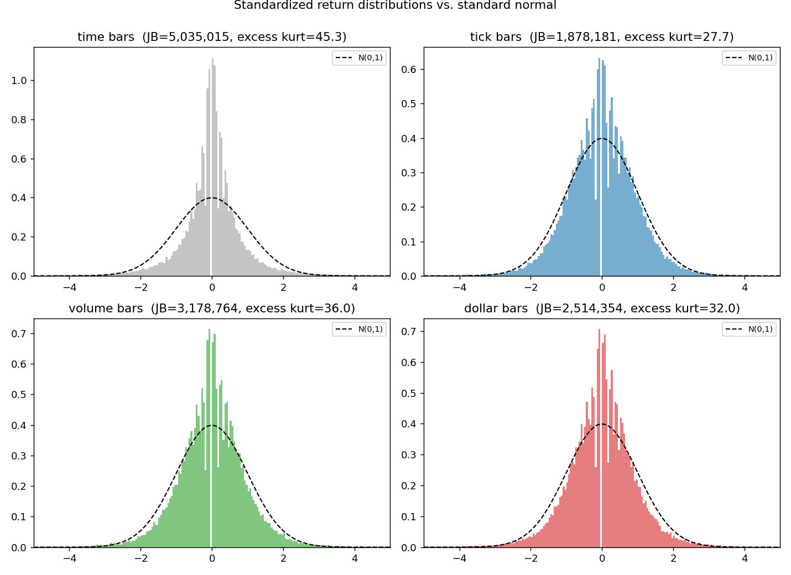

# Quant Futures Pipeline

[](https://github.com/Alzak2208/quant-futures-pipeline/actions/workflows/ci.yml)

Implementation of quantitative finance techniques from *Advances in Financial Machine Learning* (Marcos Lopez de Prado), applied to CME futures tick data.

## Project Structure

```
├── src/                       # Core library
│   ├── instrument_config.py   # Contract specs & sampling config
│   ├── data_processing.py     # Data loading, cleaning, tick rule
│   ├── bars_creator.py        # Standard, Imbalance & Runs bars (Numba)
│   ├── etf_trick.py           # ETF Trick for continuous series construction
│   └── allocation.py          # PCA-based portfolio weights
├── analysis/                  # Reproducible studies (AFML Ch.2 bar statistics)
├── results/                   # Generated figures & tables
├── data/                      # Parquet tick data (not versioned)
├── tests/                     # Unit tests
├── environment.yml
└── pyproject.toml             # Single source of dependencies & build config
```

## Pipeline

1. **Data Ingestion**: Load tick-level Parquet files (Databento format) via `data_loader`
2. **Cleaning**: Filter trades, detect contract rolls via `data_cleaner_for_bars`
3. **Bar Sampling**: Transform ticks into information-driven bars:
   - Standard: Tick, Volume, Dollar bars
   - Advanced: Imbalance bars (Tick/Volume/Dollar) with EWMA thresholds
   - Advanced: Runs bars (Tick/Volume/Dollar) for institutional flow detection
4. **ETF Trick**: Splice multiple futures into a continuous synthetic series
5. **Allocation**: PCA-based risk allocation across eigenportfolios

## Results: do information-driven bars actually deliver?

Following AFML Chapter 2, I checked whether information-driven bars give returns with better statistical properties than ordinary time bars. The test runs on ~105M E-mini S&P 500 (ES) trades across ten months of 2022. Every scheme is calibrated to the same average frequency (~58,900 bars), so the comparison is about sampling quality, not quantity. Reproduce the figures and table below with:

```bash
python -m analysis.bar_statistics
```

### 1. Sampling adapts to information flow



Time bars emit a near-constant number of bars per week (coefficient of variation 0.06) whatever the market does, so they oversample quiet periods and undersample bursts. Information-driven bars expand to ~2,500/week during the volatile Sep-Oct 2022 bottom and drop below ~400 in calm weeks. Sampling follows information, which is what we want before fitting a model.

### 2. Returns are closer to Gaussian



Lower is better for kurtosis, Jarque-Bera and the variance-stability column.

| bar type | excess kurtosis | Jarque-Bera | skew | lag-1 autocorr | monthly-var CoV |
|----------|----------------:|------------:|-----:|---------------:|----------------:|
| time     | 45.3 | 5,035,015 | -0.61 | -0.0104 | 0.31 |
| tick     | **27.7** | **1,878,181** | 0.34 | 0.0028 | **0.26** |
| volume   | 36.0 | 3,178,764 | 0.39 | **-0.0008** | 0.30 |
| dollar   | 32.0 | 2,514,354 | **-0.09** | 0.0022 | 0.29 |

A few things stand out:

- The three information-driven schemes all beat time bars on normality (lower Jarque-Bera and lower kurtosis), which is exactly the AFML claim, here on real data.
- Dollar bars are the most symmetric (skew close to 0) and the best all-rounder, so they are the default for everything downstream.
- Variance is more stationary month to month for tick and dollar bars.
- Serial correlation is negligible for every scheme. On an instrument as liquid as the E-mini there is almost no microstructure noise left to remove at this frequency, so the gain shows up in the distribution, not in autocorrelation. I would rather report that than oversell it.

The heavy tails that remain (kurtosis well above 0) are not data errors. The largest bar returns line up with scheduled macro releases, for example the +2.7% jump on 2022-12-13 at the CPI print, i.e. genuine information events.

## Instruments

ES (S&P 500), NQ (Nasdaq 100), YM (Dow Jones), CL (Crude Oil), RB (Gasoline), ZN (10Y T-Note), ZF (5Y T-Note), GC (Gold), SI (Silver), 6E (Euro FX).

## Data

The pipeline reads CME Globex tick data purchased from [Databento](https://databento.com)
(dataset `GLBX.MDP3`, `trades` schema, continuous front-month symbology `ES.c.0`, `NQ.c.0`, ...).
Raw captures are multi-GB and therefore **not versioned**; place them in `data/` as Parquet
files named `{symbol}*{period}*.parquet` (e.g. `ES_Mar2022.parquet`), which is the pattern
`data_loader` matches on. Required columns: `instrument_id`, `action`, `ts_event`, `price`, `size`.
Contract specifications (point values, tick sizes) for each symbol live in
`src/instrument_config.py`.

## Setup

```bash
# Create and activate the conda environment (installs all deps + editable package)
conda env create -f environment.yml
conda activate proj_ml_fin
```

Or with plain pip (Python >= 3.10):

```bash
pip install -e ".[dev]"
```

## Tests & Lint

```bash
pytest tests/ -v                              # unit + numerical-correctness tests
ruff check . && ruff format --check .         # lint & formatting (same as CI)
```
